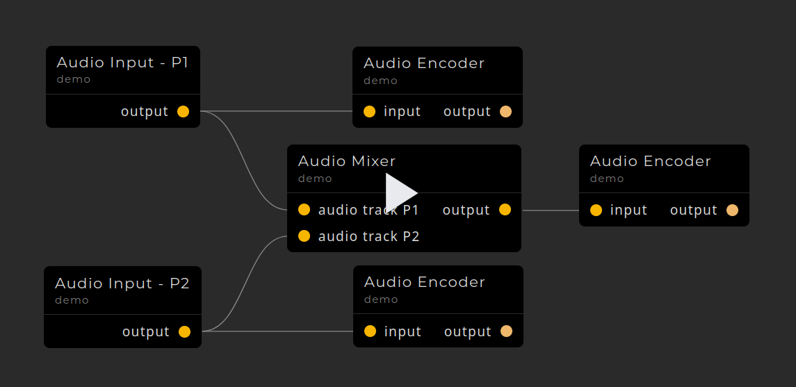

# streamtasks



Read the [Documentation](https://leopf.github.io/streamtasks).

## Demos
- [llama.cpp chatbot](docs/https:/x.com/leopfff/status/1805094491100971056)
- [playing sound effects](docs/https:/x.com/leopfff/status/1805128606839931044)
- [llama.cpp + tts](docs/https:/x.com/leopfff/status/1805138123187224636)

## Overview

Streamtasks aims to simplify software integration for data pipelines.

### How it works
Streamtasks is built on an internal network that distributes messages. The network is host agnostic. It uses the same network to communicate with services running in the same process as it does to communicate with services on a remote machine.

## Getting started

### Installation
```bash
pip install streamtasks[media,inference] # see pyproject.toml for more optional packages
```

#### Hardware encoders and decoders
To use hardware encoders and decoders you must have ffmpeg installed on your system.
Verify that you system installtion of ffmpeg has the hardware encoders/decoder with:
```bash
# list decoders
ffmpeg -decoders
# list encoders
ffmpeg -encoders
```
Install streamtasks without `av` binaries.
```bash
pip install streamtasks[media,inference] --no-binary av
```
If you have already installed streamtasks (and av), you can reinstall av with:
```bash
pip install av --no-binary av --ignore-installed
```

See [the pyav documentation](docs/https:/pyav.org/docs/develop/overview/installation.html) for more information.

#### llama.cpp with GPU
To install llama.cpp with GPU support you can either install streamtasks with:
```bash 
CMAKE_ARGS="-DLLAMA_CUBLAS=on" FORCE_CMAKE=1 pip install streamtasks[media,inference]
```

or you can reinstall llama-cpp-python with:

```bash 
CMAKE_ARGS="-DLLAMA_CUBLAS=on" FORCE_CMAKE=1 pip install llama-cpp-python --ignore-installed
```
See [the llama-cpp-python documentation](docs/https:/github.com/abetlen/llama-cpp-python) for more information.


### Running an instance
You can run an instance of the streamtasks system with `streamtasks -C` or `python -m streamtasks -C`.

The flag `-C` indicates that the core components should be started as well.

Use `streamtasks --help` for more options.

### Connecting two instances
When connecting two instances you need to have one main instance running the core components (using `-C`).

To create a connection endpoint (server), you can use the Connection Manager in the UI or you can specify a url to host a server on as a command line flag.

For example:
```bash
streamtasks -C --serve tcp://127.0.0.1:9002
```

You may specify multiple serve urls.

To connect the second system to the main system, you need to start your second system **without** the core components, specifying a connect url.

For example:
```bash
streamtasks --connect tcp://127.0.0.1:9002
```

See [connection](docs/connection.md) for more information.