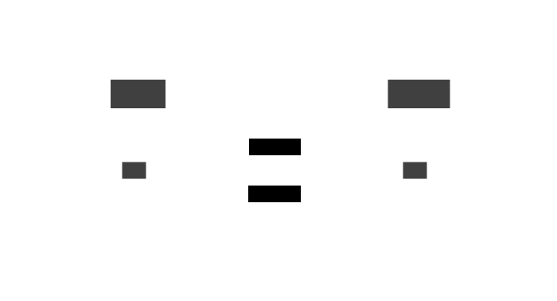

# Network
module: `streamtasks.net`

The streamtasks network is a host independent network that is used to communicate with receivers/services.

The network consists of connections. A connection is made up of two links.


The messages sent over links are distributed by switches. A Client can be used to simplify the usage of links.



## Links
### Queue Link
Default link used when creating new internal connections.

A simple link based on message queues.

### Topic Remapping Link
A link used to remap specified topic ids using a map of ids. This can only be used by wrapping an existing link.

### Raw Connection Link
module: `streamtasks.connection`

A link sending data over a raw connection, like a TCP connection. 

See [Connection](../connection.md) for more information.

## Messages

#### Priced Id
```python
id: int
cost: int
```

#### Raw Data
Raw data can be created from bytes of serialized message pack data (bytes/bytearray/memoryview) or by providing a message pack serializable python object, like a `dict`.

The Raw data is used to serialize and deserialize the inner data on demand.

The deserialized data can be accesses with `RawData(<some data>).data`.
The data can be serialized with `RawData(<some data>).serialize()`.

Serialization is only done if a link requires the data to be serialized.

---

* **TopicDataMessage** - data to be distributed on a topic 
```python
topic: int
data: 'RawData'
```

* **TopicControlMessage** - sets the state of a topic
```python
topic: int
paused: bool
```

* **AddressedMessage** - sends data to an address on a port
```python
address: int
port: int
data: 'RawData'
```

* **AddressesChangedMessage** - a link sends this message to change what addresses can be reached from this link.
```python
add: set[PricedId]
remove: set[int]
```

* **InTopicsChangedMessage** - a links sends this message to set what topic messages should be sent to it.
```python
add: set[int]
remove: set[int]
```

* **OutTopicsChangedMessage** - a links sends this message to set what topics it provides. The topics can be requested if the other party sends a **InTopicsChangedMessage**.
```python
add: set[PricedId]
remove: set[int]
```


## Client
See [Client](client.md) for more information.
